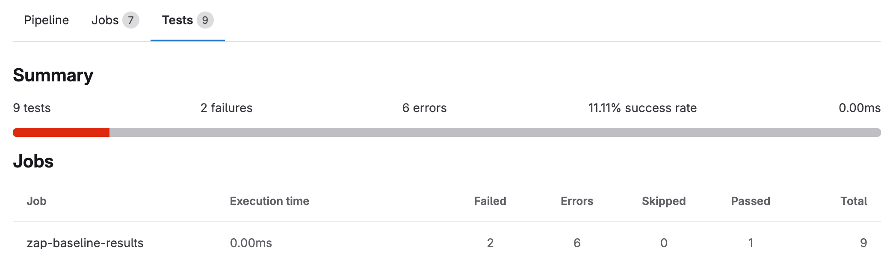
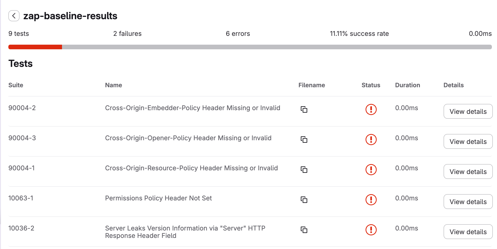
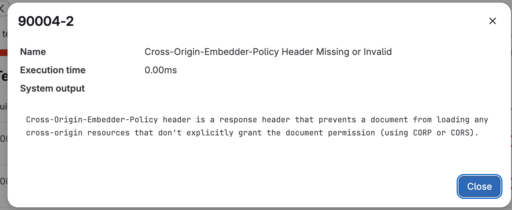

# ZAP junit converter

 [](https://github.com/Digitalist-Open-Cloud/ZAP-JUnit-converter/actions/workflows/tests.yaml)
[](https://github.com/Digitalist-Open-Cloud/ZAP-JUnit-converter/actions/workflows/github-code-scanning/codeql)
[](https://github.com/Digitalist-Open-Cloud/ZAP-JUnit-converter/actions/workflows/bandit.yaml)

Convert OWASP Zed Attack Proxy (ZAP) JSON output to JUnit XML format.

Could be used for converting output from ZAP to be displayed as tests results in GitLab.

## Installation

```shell
pip install zap-junit
```

## Usage

```bash
zap-junit input.json -o output.xml
```

## Testing

```bash
poetry run pytest -v
```

## Coverage Report

```bash
poetry run pytest --cov
```

## Example usage

### GitLab runner

This needs a run of ZAP in the earlier, saving the results as  `zap-baseline-report.json `.

```yaml
zap-baseline-results:
  stage: convert
  image:
    name: digitalist/zap-junit-converter:0.2
    entrypoint: [""]
  script:
    - |
      zap-junit zap-baseline-report.json  -o results.xml
  rules:
    - if: $CI_COMMIT_TAG
  artifacts:
    untracked: false
    expire_in: 2 days
    paths:
      - results.xml
    reports:
      junit: results.xml
```



